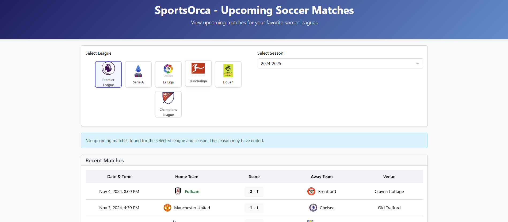

# SportsOrca - Upcoming Soccer Matches

## Overview
A clean, responsive web application that displays upcoming and recent soccer matches using TheSportsDB API. This project was created as part of the SportsOrca Full Stack Development Internship task, completed within the 30-minute timeframe requirement.



## Features

- **Match Display**: Shows upcoming soccer matches with team logos, match date/time, and venue
- **Recent Matches**: Displays completed matches with scores and highlights winning teams
- **Visual League Selection**: Intuitive league selection with official logos
- **Season Filtering**: Filter matches by different seasons
- **Responsive Design**: Works seamlessly on mobile, tablet, and desktop devices
- **Real-time Updates**: Refresh button to fetch the latest match data
- **Error Handling**: User-friendly error messages and fallback data
- **Loading States**: Visual feedback during data fetching

## API Information

This project uses the free tier of TheSportsDB API:
- **API URL**: `https://www.thesportsdb.com/api/v1/json/3/`
- **No API key required** for the endpoints used

### Main Endpoints Used

- `eventsseason.php?id={leagueId}&s={season}` - Get matches for a specific league and season
- `lookupteam.php?id={teamId}` - Get team details including logos
- `all_leagues.php?s=Soccer` - Get all soccer leagues

## Tech Stack

- **HTML5** - Semantic markup structure
- **CSS3** - Modern styling with flexbox and animations
- **JavaScript (ES6+)** - Async/await, Fetch API, DOM manipulation
- **Bootstrap 5** - Responsive grid and components

## Project Structure

```
sportsorca/
├── index.html            # Main HTML file with structure and styles
├── main.js               # JavaScript for API calls and DOM updates
├── .gitignore            # Git ignore file for node_modules, etc.
└── README.md             # Project documentation
```

## Running the Project

### Prerequisites
- Any modern web browser

### Quick Start
1. Clone this repository:
   ```
   git clone https://github.com/pranay-sathish/sportsorca.git
   ```

2. Open `index.html` in your browser:
   - Double-click the file in your file explorer, or
   - Use a local development server:
     ```
     npx http-server
     ```
     Then open http://localhost:8080 in your browser

## Implementation Details

### API Integration
The application makes direct API calls to TheSportsDB using the Fetch API. Key functions:

```javascript
// Fetch matches for a specific league and season
async function fetchMatches(leagueId, season) {
  // API call to get matches
  const response = await fetch(`${API_BASE_URL}/eventsseason.php?id=${leagueId}&s=${season}`);
  const data = await response.json();
  
  // Process and display matches
  // ...
}
```

### Error Handling
The application implements comprehensive error handling:
- Network connectivity issues
- API unavailability
- No matches found for selected criteria
- Image loading failures

### Responsive Design
The UI is fully responsive with specific optimizations for:
- Mobile devices (< 576px)
- Tablets (576px - 992px)
- Desktops (> 992px)

## Future Enhancements

With more time, I would implement:
- Team search functionality
- Match details view with statistics
- League standings/tables
- User preferences (favorite teams/leagues)
- Dark mode theme

## Submission Information

- **Candidate**: Pranay J Sathish
- **Task**: SportsOrca Full Stack Development Internship
- **Completion Time**: Approximately 30 minutes
- **Submission Date**: May 29, 2025

---

This project demonstrates my ability to quickly create clean, functional web applications with modern JavaScript practices and responsive design principles.
